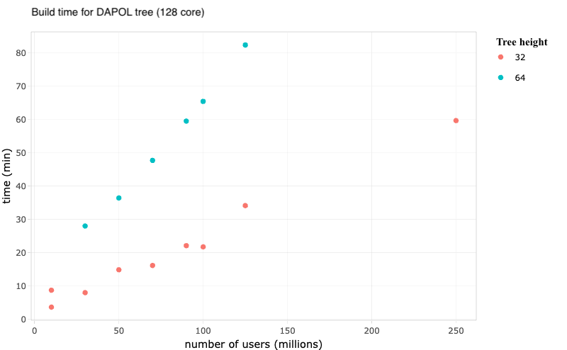
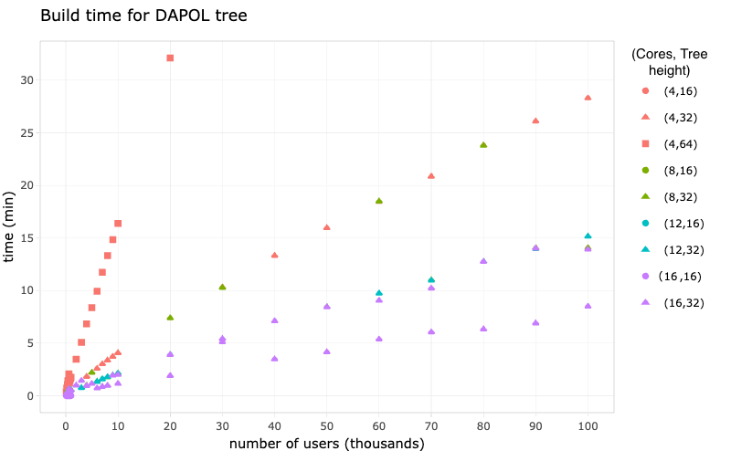
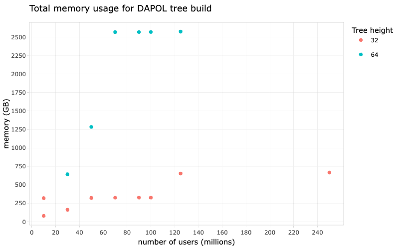
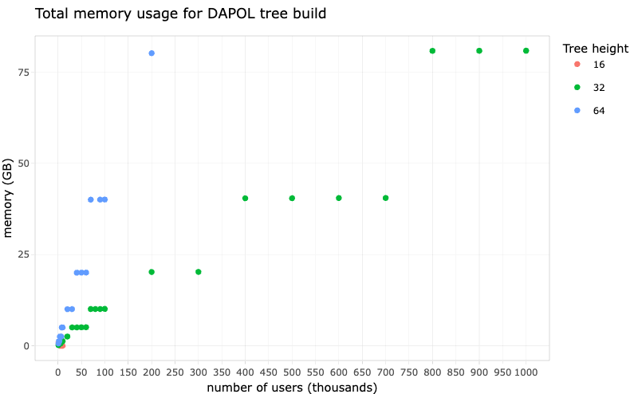
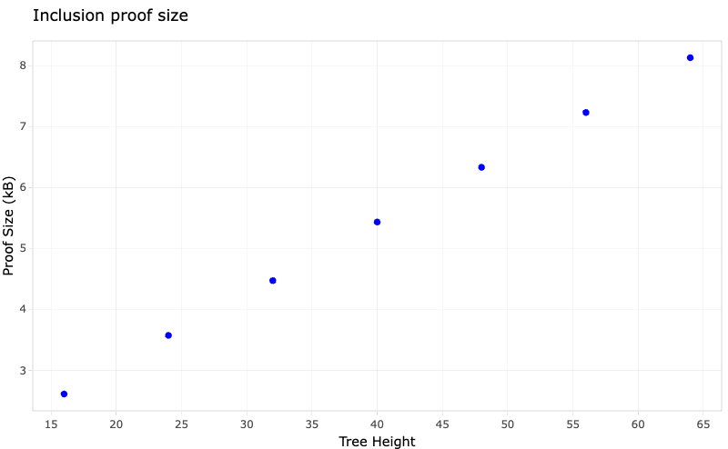

# Proof of Liabilities protocol implemented in Rust

[](https://crates.io/crates/dapol)
[](LICENSE)
[](https://github.com/silversixpence-crypto/dapol/actions/workflows/ci.yml?query=branch%3Amain)

Licensed under [MIT](LICENSE).

## About this repo

This repo is a Rust implementation of the DAPOL+ protocol, which was introduced in the "Generalized Proof of Liabilities" ACM CCS 2021 paper, by Yan Ji and Konstantinos Chalkias (available [here](https://eprint.iacr.org/2021/1350)).

DAPOL+ (Distributed Auditing Proof of Liabilities) is a protocol around a Merkle Sum Tree that allows an entity to cryptographically commit to it's liabilities in a way that maintains data privacy and verifiability. Some examples of where this protocol is useful:
- Centralized cryptocurrency exchange uses DAPOL+ to commit to the digital asset balances it owes it's users, and the users can verify that their balances are correctly represented in the tree
- Hospitals commit to their COVID case count, and their patients can check that their case was correctly recorded

This repo is part of a larger Proof of Reserves project. For more information on Proof of Liabilities you can check out [this blog](https://reservex.io/blogs/1). And for more information on the Proof of Reserves project in general you can check out this [top-level doc for the project](https://hackmd.io/p0dy3R0RS5qpm3sX-_zreA).

If you would like to contact the owners to get advice on how to integrate this protocol into your system, then reach out [here](https://reservex.io/contact).

## Still to be done

This repo is still a work in progress, but is ready for
use as is. The code has _not_ been audited yet (as of May 2024) and so it is not recommended to use it in production yet. Progress on the audit can be tracked [here](https://github.com/silversixpence-crypto/dapol/issues/91).

Important tasks still to be done:
- Write a spec: https://github.com/silversixpence-crypto/dapol/issues/17
- Support the Deterministic mapping SMT accumulator type: https://github.com/silversixpence-crypto/dapol/issues/9
- Sort out version issues with dependencies: https://github.com/silversixpence-crypto/dapol/issues/11
- Allow the tree to be updatable: https://github.com/silversixpence-crypto/dapol/issues/109
- Finish integration tests: https://github.com/silversixpence-crypto/dapol/issues/42
- Use a database as the backend storage system (as opposed to memory): https://github.com/silversixpence-crypto/dapol/issues/44

## How this code can be used

There is both a Rust API and a CLI. Details for both can be found in the sections below.

### Rust API

The API has the following capabilities:
- build a tree using the builder pattern or a configuration file
- generate inclusion proofs from a list of entity IDs (tree required)
- verify an inclusion proof using a root hash (no tree required)

See the [examples](https://github.com/silversixpence-crypto/dapol/examples) directory or [docs](https://docs.rs/dapol/latest/dapol/#rust-api) for details on how to use the API.

### CLI

Install with cargo:
```bash
cargo install dapol
```

You can invoke the CLI like so:
```bash
dapol help
```

The CLI offers 3 main operations: tree building, proof generation & proof verification. All options can be explored with:
```bash
dapol build-tree help
dapol gen-proofs help
dapol verify-proof help
```

#### Tree building

Building a tree can be done:
- from a config file (see dapol_config_example.toml)
- from CLI arguments
- by deserializing an already-built tree

Build a tree using config file (full log verbosity):
```bash
dapol -vvv build-tree config-file ./examples/dapol_config_example.toml
```

Add serialization:
```bash
dapol -vvv build-tree config-file ./examples/dapol_config_example.toml --serialize .
```

Deserialize a tree from a file:
```bash
dapol -vvv build-tree deserialize <file>
```

Generate proofs (proofs will live in the `./inclusion_proofs/` directory):
```bash
dapol -vvv build-tree config-file ./examples/dapol_config_example.toml --gen-proofs ./examples/entities_example.csv
```

Build a tree using cli args as apposed to a config file:
```bash
# this will generate 1000 random entities
dapol -vvv build-tree new --accumulator ndm-smt --height 16 --random-entities 1000 --secrets-file ./examples/dapol_secrets_example.toml
```

#### Proof generation

As seen above, the proof generation can be done via the tree build command, but it can also be done via its own command, which offers some more options around how the proofs are generated.

```bash
dapol -vvv gen-proofs --entity-ids ./examples/entities_example.csv --tree-file <serialized_tree_file>
```

```bash
echo "david.martin@example.com" | dapol -vvv gen-proofs --tree-file examples/my_serialized_tree_for_testing.dapoltree --entitiy-ids -
```

The proof generation command only offers 1 way to inject the tree (deserialization), as apposed to the tree build which offers different options.

#### Proof verification

```bash
dapol -vvv verify-proof --file-path <inclusion_proof_file> --root-hash <hash>
```

The root hash is logged out at info level when the tree is built or deserialized.

## Development

To get access to the CLI for a local copy of the repo you can do the following:
```bash
cargo build --release
./target/release/dapol help
```

To run the doc, unit & integration tests you can do
```bash
cargo test
```

### Run the fuzz unit tests

Follow the steps in the [Rust Fuzz Book](https://rust-fuzz.github.io/book/introduction.html) to get started. Essentially:
```bash
# The cargo-fuzz / libfuzzer duo is used
cargo install cargo-fuzz

# Need nightly for cargo-fuzz
rustup default nightly

# Run the max_nodes_to_store block, and don't do more than 300k runs.
cargo fuzz run max_nodes_to_store -- -runs=300000
```

## Benchmarks

To run the benchmarks first clone the repo and then run:
```bash
# Run the benchmarks written in the Criterion framework.
cargo bench --bench criterion_benches

# Run the benchmarks written without a framework.
cargo bench --bench manual_benches

# available env vars (with their default values):
MIN_TOTAL_THREAD_COUNT=0
MIN_ENTITIES=0
MAX_ENTITIES=250000000
MIN_HEIGHT=2
MAX_HEIGHT=64
LOG_VERBOSITY=none # supports error, warn, info, debug
```

A set of tuples is used as input to the benches:


The benches are split into 2 parts: Criterion (for small benches) and manual (for large benches). Some of the values of $n$ cause the benchmarks to take *really* long (up to an hour), and so using Criterion (which takes a minimum of 10 samples per bench) makes things too slow. It is advised to run Criterion benches for $n<1000000$ and manual benches otherwise.

You may experience an error building the benches if you are on a fresh Linux machine. If the jemalloc-sys package fails to build then maybe [this](https://github.com/tikv/jemallocator/issues/29) will help.








